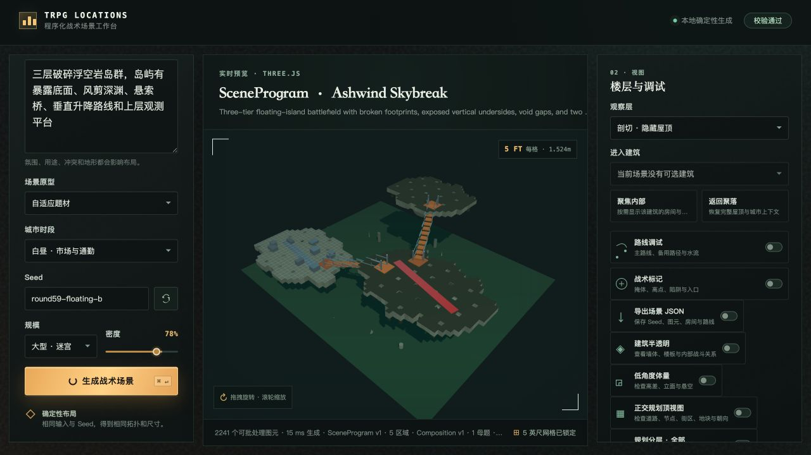
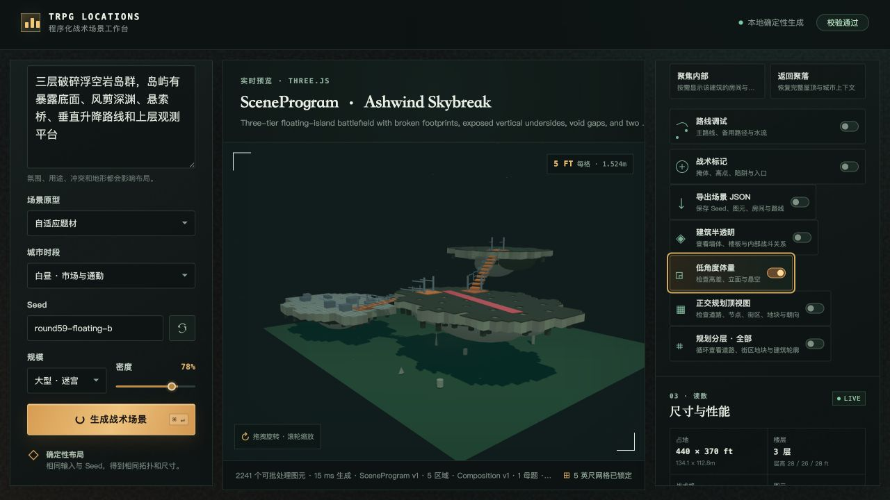
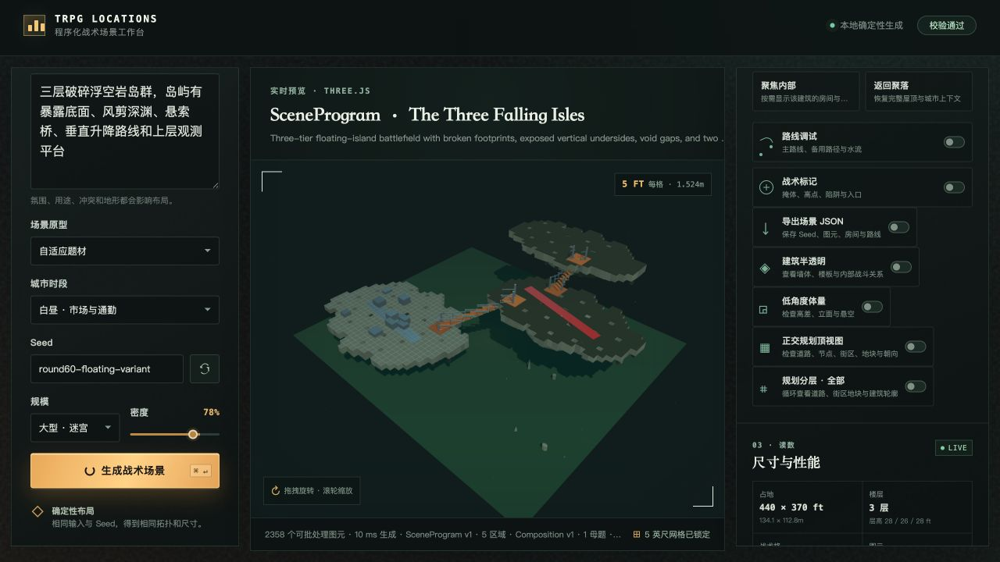

# Round 60 — 浮空岛屿连续体与 Seed 布局回归

日期：2026-08-09  
提示词：三层破碎浮空岩岛群，岛屿有暴露底面、风剪深渊、悬索桥、垂直升降路线和上层观测平台

## 本轮改动

- 三座浮岛不再固定在同一套坐标和尺寸，Seed 驱动中心位置、占地、层高和桥接方向。
- 最低层抬离绿色基底，三层高度改为 Seed 驱动的约 26–30、50–58、76–88 英尺区间。
- 每个岛面继续使用确定性 occupancy mask；每个可站立格都有连续 underside。
- 增加大尺度侵蚀岩核，降低逐格 underside 的厚度，避免底部看起来像整齐方柱。
- 悬索桥增加桥塔、护栏分段、上方主索、吊杆和支撑标签。
- 低角度相机改为更低、更近的场景检查角度。
- 新增自动回归：underside 与 surface 接触、厚度变化、岩核数量、桥塔/护栏/吊杆、同 Seed 重放、换 Seed 宏观布局变化。

## 视觉验收

### 同 Seed：`round59-floating-b`

规模：大型 · 迷宫；密度：78%；三层；15 ms；约 2,241 图元；诊断 99/100。

- 通过：三层实际离地；岛面与 underside 接触；两条垂直路线有 landing；桥端落在岛体；顶视可见三层关系；同 Seed 结构稳定。
- 未通过：总览中绿色底板仍偏抢眼；暗色岩底需要更强材质层次；悬索主索在远景中偏细。





### 换 Seed：`round60-floating-variant`

规模：大型 · 迷宫；密度：78%；三层；10 ms；约 2,358 图元；诊断 99/100。

- 通过：岛屿中心、占地、层高、破碎轮廓和桥接方向发生变化；不是只移动装饰。
- 未通过：材质和远景可读性问题与同 Seed 共有。



## 自动验证

```text
12 test files passed
211 tests passed
npm run build passed
git diff --check passed
```

## 结论

本轮将浮空岛从“平台堆叠”推进为“有离地高度、连续底部质量、支撑交通和 Seed 驱动宏观布局”的可审计空间。浮岛能力继续保持 `prototype`，原因是材质、桥索远景可读性和底板关系仍需下一轮视觉优化。
