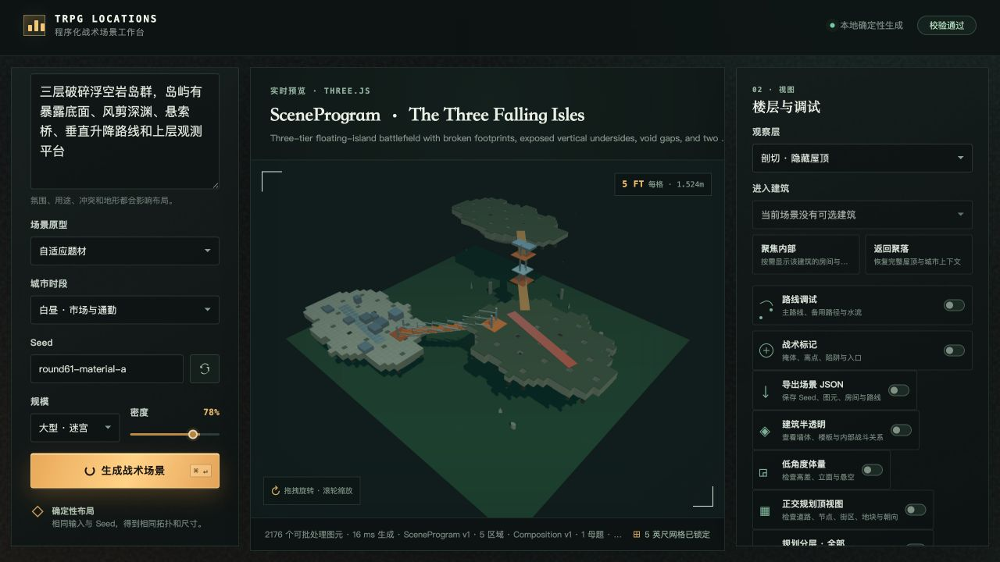
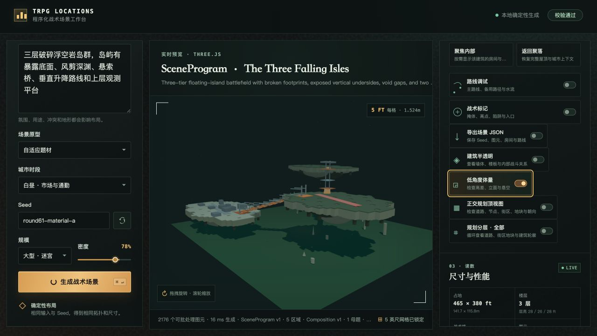
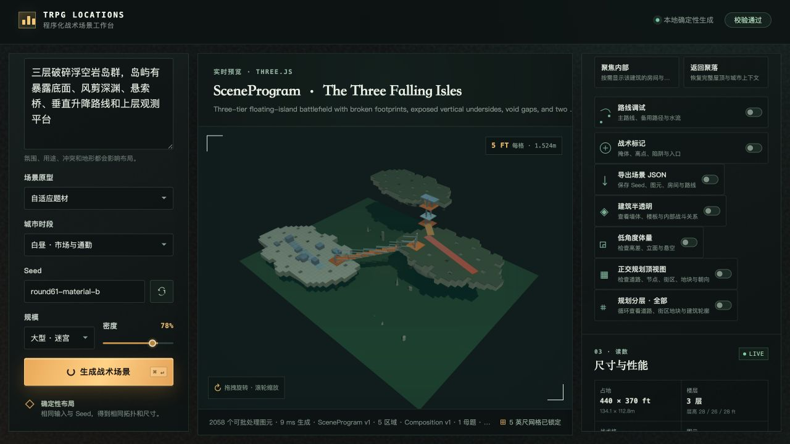

# Round 61 — 浮岛交通语法与材质可读性

日期：2026-08-09

## 验收提示

三层破碎浮空岩岛群，岛屿有暴露底面、风剪深渊、悬索桥、垂直升降路线和上层观测平台

## 本轮改动

- 浮岛表面、岛缘 underside、深部侵蚀岩核分离为稳定的区域材质色。
- 悬索主索和护栏使用独立高对比材质，避免远景消失。
- 第二段垂直交通不再复制斜梯，改为链式升降平台：
  - 下层和上层 gangway；
  - 升降笼平台；
  - 双导轨；
  - 双吊链；
  - 顶部绞盘；
  - 中段真实可站立平台；
  - 独立 vertical route。
- 为升降平台补充 `platform`、`shaft-access`、`vertical-opening` 和支撑语义，使几何验证真实通过。

## 浏览器视觉验收

### Seed `round61-material-a`

规模：大型 · 迷宫  
密度：78%  
生成：16 ms；约 2,176 图元；诊断 99/100。

通过：

- 隐藏标题仍能辨认三层浮空岛；
- 岛体有连续 underside 和离地高度；
- 左侧为悬索桥，中央为链式升降平台，交通语法明显不同；
- 升降平台有上下 landing、导轨、吊链和顶部绞盘；
- 低角度能看到岛底和垂直关系；
- 同 Seed 结构可复现。

仍未通过：

- 总览中升降平台偏细，需要下一轮增加局部近景或更强体量；
- 底板仍比理想状态更抢眼；
- 深部岩核和阴影层次仍可继续增强。





### Seed `round61-material-b`

规模：大型 · 迷宫  
密度：78%  
生成：9 ms；约 2,058 图元。

通过：

- 岛屿布局、尺度和破碎轮廓变化；
- 悬索桥与升降平台语法保持；
- 没有退回默认模板。



## 自动验证

```text
12 test files passed
211 tests passed
npm run build passed
git diff --check passed
```

专项诊断曾在第一次加入升降平台时发现 2 个真实几何错误；修复后为：

```text
valid: true
score: 99
warnings: []
geometryErrorCount: 0
routePointsNearWalkable: 10/10
```

## 结论

Round 61 完成了浮岛场景中“悬索桥”和“垂直升降路线”的结构分化，并提升了材质可读性。浮岛能力继续保持 `prototype`，下一轮重点应是升降平台局部镜头、岛底侵蚀体块和底板/阴影关系。
