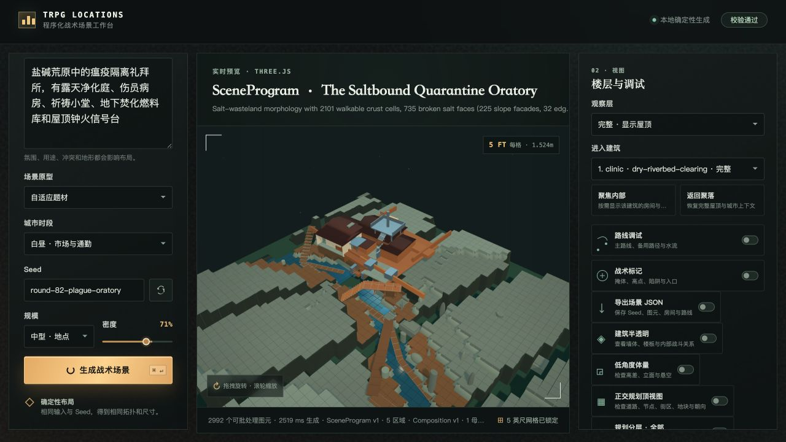
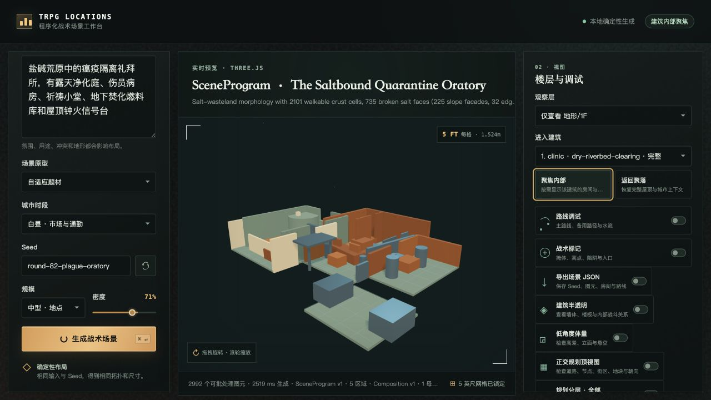
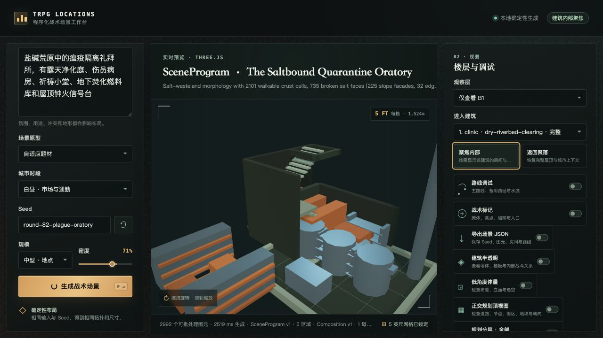
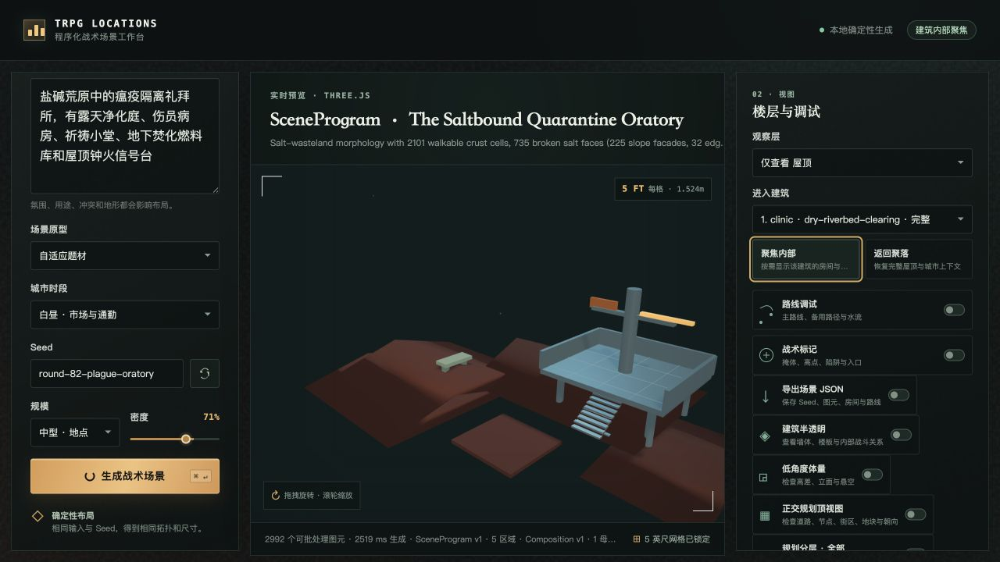
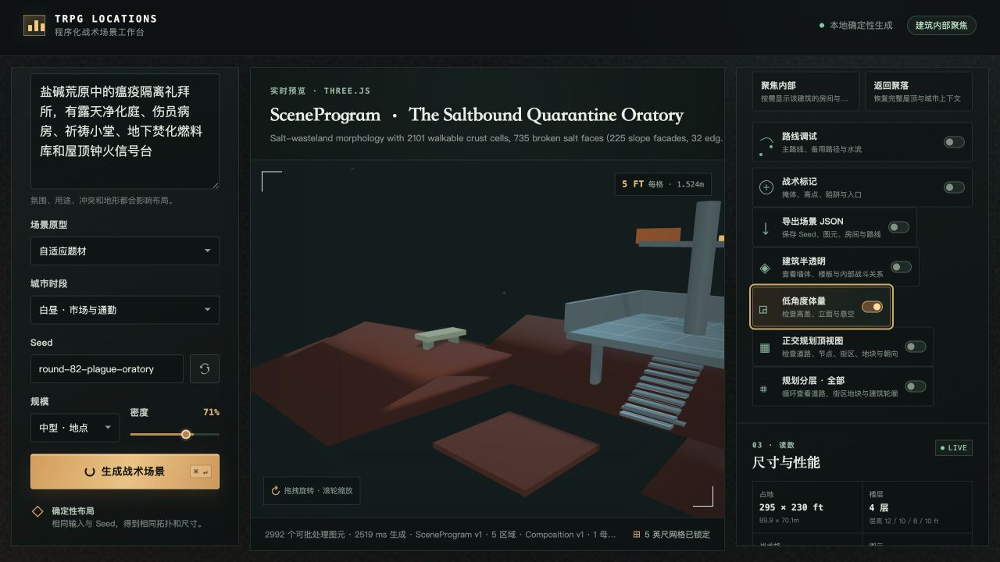
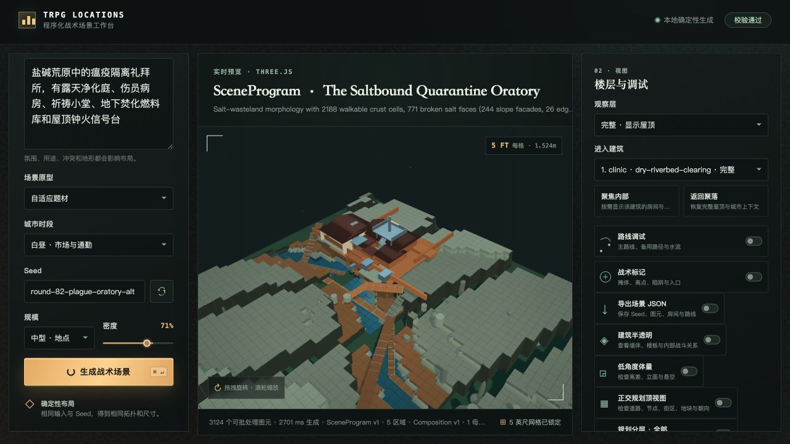

# Round 82 visual audit

## Scope

This round verifies the building–terrain composition interface rather than a
standalone building or a generic natural map. The main regression prompt is:

> 盐碱荒原中的瘟疫隔离礼拜所，有露天净化庭、伤员病房、祈祷小堂、地下焚化燃料库和屋顶钟火信号台

Parameters:

- Primary seed: `round-82-plague-oratory`
- Variation seed: `round-82-plague-oratory-alt`
- Size: `medium`
- Density: `71%`
- Prototype: `adaptive`
- Grid: `5 ft`

## Failures found by the browser loop

1. The first realization fell back to the mountain grammar and presented
   `The Broken Heights`. The requested salt wasteland was absent even though
   the quarantine building modules existed.
2. The parent overview was too distant for a single authored compound.
3. The old “low angle” action reused an ordinary focused camera and did not
   provide a true massing inspection view.
4. Known facility profiles erased additional prompt-owned spaces. A quarantine
   station could silently drop the requested chapel, medical wing, fuel bunker,
   or signal platform.
5. The alternate seed exposed a chapel route passing through the solid west
   wall of the isolation wing.

## Corrections

- Added a deterministic salt-wasteland realization with broken salt crust,
  low brine basins, raised salt ridges, salt spires, exposed seams, and two
  distinct tactical routes.
- Recognized salt-flat language before the generic mountain fallback.
- Kept the quarantine profile as the base program while merging additional
  prompt-owned functional atoms.
- Added real open-air decontamination-court geometry, drainage, wash pillars,
  control screens, a route, and a tactical chokepoint.
- Added dedicated low-angle camera factors and tightened single-site parent
  framing.
- Added route-aware medical-wing placement.
- Cut a real door gap through any profiled envelope wall crossed by a
  prompt-owned chapel connector; the alternate seed now validates without a
  wall-intersection warning.

## Screenshots

### Parent terrain and compound

Pass:

- Title and landform are identifiable without relying on metadata.
- Salt crust, brine channels, broken faces, raised ridges, and the compound
  coexist in one parent scene.
- The compound remains the tactical subject while retaining immediate terrain
  context.

Remaining:

- The overview is intentionally broad enough to explain the access terrain, so
  small room fixtures still require the focused views below.

### Ground floor

Pass:

- Quarantine reception, open-air decontamination court, medical wing, chapel
  wing, screens, beds, pew rhythm, and wash pillars are realized as geometry.
- The chapel and medical volumes are independent wings rather than labels in
  one rectangular room.

Remaining:

- The complete ground-floor compound is dense; room-purpose readability is
  stronger after orbiting than in one fixed screenshot.

### Basement fuel store

Pass:

- The fuel store is below grade and contains containment curbs, tanks,
  manifold, control valve, ventilation, and folded stair access.
- The stair has actual landings and walls instead of one stretched ramp.

Remaining:

- The basement stairwell and fuel kit are visually crowded from the current
  fixed diagonal; a future renderer pass should allow a local room camera.

### Roof signal platform

Pass:

- The signal deck has physical height, supports, guard edges, access stairs,
  mast, and a visible signal arm.
- The platform is reachable and not a zero-height painted rectangle.

### Low-angle massing

Pass:

- The low camera is lower and closer than the standard focus view.
- Supports, stair rise, roof platform height, and exposed edges are inspectable.

### Seed variation

Pass:

- The alternate seed changes crust fractures, brine geometry, terrain faces,
  route shape, building placement, and primitive count.
- The alternate seed now reports `98 / 100` and `校验通过`.
- The chapel connector no longer passes through a solid isolation-wing wall.

## Automated evidence

- Target regression: `182/182` passed during the visual-fix loop.
- Final project check after the real door-gap guard: `246/246` passed.
- TypeScript project build passed.
- Vite production build passed.
- `git diff --check` passed.

## Honest remaining work

- The B1 fixed camera remains too visually compressed for large stair and
  machinery rooms.
- “Salt wasteland” currently uses the dry-wilderness domain slot with its own
  realizer rather than a new public schema enum. The rendered result is
  distinct, but the diagnostics district label still reads
  `dry-riverbed-clearing`.
- Broader unfamiliar biome vocabulary still needs the same atomized treatment;
  this round proves the interface on one previously failing combination rather
  than claiming universal coverage.
